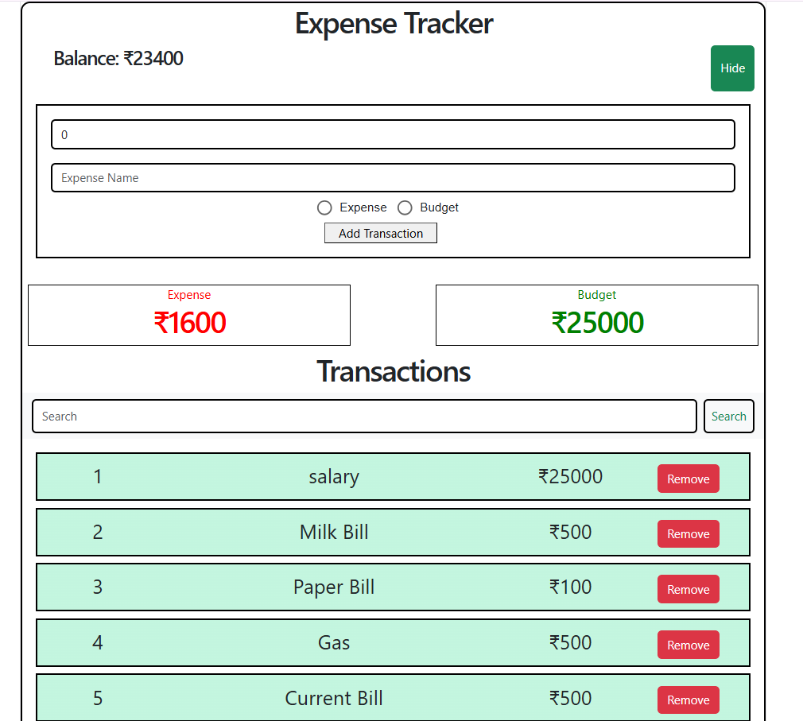

Expense Tracker:

Project Description:
Expense Tracker is React Application By Using This Expense Tracker We Can Add Add Our Expense and Budget, We Can Search Our Transactions and View The Total Budget, Totoal Expense And Removes Over Expense Form Our Budget.

Features:

Add Budget
Add Expense 
Search Budget Or Expense
Calculate Totoal Budget
Calculate Total Expense
Display Balance

Technologies Used:

React js
Html
Css
JavaScript
BootStrap
UI Material

 
 After Cloning We need to Install this Extensions:
BootStrap: npm install bootstrap@5.3.8
Ui Material:
npm install @mui/material @mui/styled-engine-sc styled-components

npm install @mui/material @emotion/react @emotion/styled

npm install react-is@18.3.1

npm install @mui/icons-material

Router: 
npm install react-hook-form 

npm install react-router-dom

screenshort:

Author
Name: Kandukuri Namitha

GitHub: https://github.com/kandukurinamitha-1902
Email: kandukurinamitha@gmail.com

License

This project is created for learning purposes.

